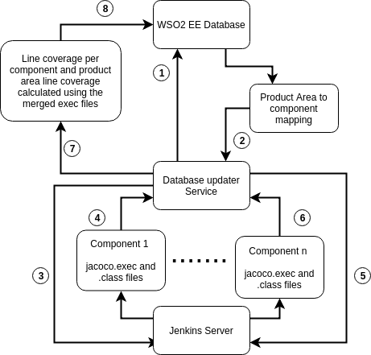

# product-code-coverage-service

Powered By         |  Talks With
:-------------------------:|:-------------------------:
  |  

## Introduction 

This web service is used to calculate true code coverage in a product area in WSO2. As a product area contain 
multiple repositories and some of them actually uses each other. For an example, a product repository might be using a 
carbon repository in WSO2's case. In this scenario during tests, product repository might actually be testing a part of the code from a 
carbon repository with it's integration tests. This code part might not be tested during tests in carbon repository. In this case to obtain true code coverage of a product area component, one might need to consider test coverage of classes in the whole product area.

## Workflow

This web service is fed with a set of product areas, each with product area to component mapping information. Service is then use Jenkins server to collect compiled class files, java source files and jacoco execution data file of each component.
Keep in mind that proper plugins should be installed in the Jenkins server to provide the service with this data. We used a [custom plugin](https://github.com/hasithajayasundara/Class-Files-Collector) for compiled class files collection and Jenkins jacoco plugin for the jacoco execution data. 

In a summarized way, after the data collection this service get all the execution data files and aggregate all of them to a one report and use that to get true code coverage value per component for a product area. The procedure we used in WSO2 is drawn below.

